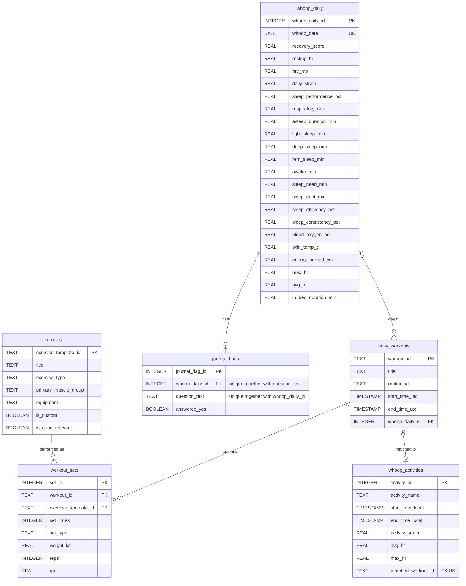

# DataFitnessProject

A personal project built on my own fitness data. I lift with Hevy and track sleep and recovery with Whoop, and the two apps don't talk to each other. Hevy knows what I lifted, Whoop knows how I recovered, and neither knows about the other.

The goal is to work through a full data project end to end, using a different tool at each stage:

| Stage | Tool | Status |
|---|---|---|
| Collecting and cleaning the data | Python | Done |
| Storing it | SQL, with a database I designed myself | Done |
| Dashboard | Tableau | In progress |
| Machine learning | | Planned |
| Agentic AI | | Planned |

## What's done so far

- **Pulling Hevy data.** `DataRetrieval.py` calls the Hevy API and saves my last 200 days of workouts and the full list of exercise templates as JSON.
- **Database design.** A SQLite schema with six tables (see below). It lives in `db/schema.sql`.
- **Loading Hevy data.** `data_pipeline/load_hevy_data.py` reads the JSON files and fills the `exercises`, `hevy_workouts` and `workout_sets` tables.
- **Loading Whoop data.** I request a data export from the Whoop app, which gives me CSV files. `data_pipeline/load_whoop_data.py` loads them into `whoop_daily`, `journal_flags` and `whoop_activities`.
- **Linking the two sources.** The same script matches each Whoop activity to the Hevy workout that started within 20 minutes of it, and assigns each Hevy workout to the Whoop day it falls in.
- **Export for Tableau.** `data_pipeline/data.py` writes every table to one Excel workbook, one sheet per table.

The loading scripts can be run again without creating duplicates. Existing rows are updated instead.

## Database schema

PK = primary key, FK = foreign key, UK = unique key (no two rows can have the same value). The SQL itself is in [db/schema.sql](db/schema.sql).

| Table | One row is | Source |
|---|---|---|
| `exercises` | an exercise (e.g. Leg Press), with its muscle group and equipment | Hevy |
| `hevy_workouts` | one gym session | Hevy |
| `workout_sets` | one set within a session: weight, reps, RPE | Hevy |
| `whoop_daily` | one day of recovery, sleep and strain metrics | Whoop |
| `whoop_activities` | one activity Whoop recorded, with strain and heart rate | Whoop |
| `journal_flags` | one yes/no answer to a Whoop journal question for a day | Whoop |

A few choices I made in the design:

- **A Whoop day is dated by when I woke up**, not by when the cycle started. Whoop cycles begin when I fall asleep, which is usually the evening before, so using the wake time puts the sleep on the day it affects.
- **`hevy_workouts.whoop_daily_id`** ties each gym session to that day's recovery and sleep. This is the main link between the two sources.
- **`whoop_activities.matched_workout_id`** is unique, so one Hevy workout can only be matched to one Whoop activity. If two Whoop activities are close to the same workout, the closer one wins.
- **`is_quad_relevant`** flags exercises whose primary muscle group is quadriceps.

## About the data

The repository only contains code. My own data (the database, the JSON and CSV files, and the Excel export) is left out through `.gitignore`.
